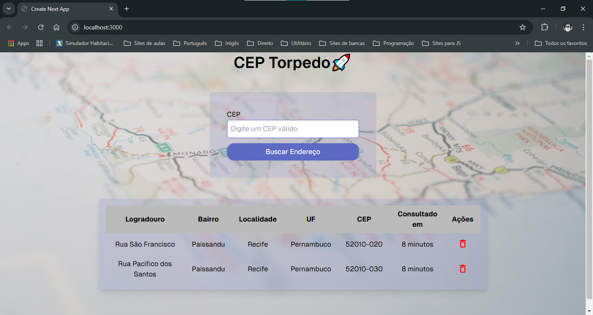

# My App CEP 🚀

Este é um projeto de portfólio pessoal desenvolvido para consolidar meus conhecimentos em programação front-end. O foco principal foi o uso de APIs, armazenamento de dados com o `localStorage`, e a integração de bibliotecas JavaScript para otimizar a interface do usuário e a experiência de uso.

## Visão Geral

O **My App CEP** é uma aplicação que permite ao usuário buscar informações sobre endereços a partir do CEP. A aplicação consulta uma API externa para obter dados atualizados e armazena localmente o histórico de consultas, permitindo que o usuário acesse as informações mesmo ao atualizar a página.


<div>
    
</div>


## Funcionalidades

- **Busca de endereços por CEP**: Consulta uma API para obter dados de endereço com base no CEP informado pelo usuário.
- **Armazenamento Local (localStorage)**: Os dados consultados são armazenados no `localStorage` para que possam ser exibidos novamente ao reabrir ou recarregar a aplicação.
- **Gerenciamento de Histórico**: O usuário pode excluir entradas específicas do histórico de consultas de forma dinâmica.

## Funcionalidades Técnicas

### 1. Consumo de API

A aplicação realiza uma requisição a uma API externa para consultar informações de um endereço a partir do CEP informado pelo usuário. Após a requisição, os dados são armazenados no estado da aplicação e exibidos em uma tabela. Este processo utiliza `async/await` e manipulação de erros para garantir uma boa experiência de usuário.

### 2. Armazenamento Local

Com o uso de `localStorage`, os endereços consultados pelo usuário são persistidos, permitindo que o histórico de consultas seja mantido mesmo após o fechamento e reabertura do navegador. A aplicação recupera e exibe esses dados no início da navegação, oferecendo uma experiência contínua ao usuário.

### 3. Componentes e Bibliotecas

- **MyButton**: Um botão customizado que aciona a consulta de um novo endereço via API.
- **Animações com Framer Motion**: Para dar um toque interativo à interface, utilizamos animações de entrada e saída para os componentes.
- **Tailwind CSS**: A utilização do Tailwind permitiu um design rápido e responsivo, adaptando-se a diferentes tamanhos de tela, desde dispositivos móveis até desktops.

## Tecnologias Utilizadas

### Linguagens e Frameworks
- **Next.js**: Framework utilizado para construir a aplicação com renderização de páginas e suporte a Server-Side Rendering (SSR).
- **React**: Biblioteca principal para construção dos componentes interativos da interface.

### Bibliotecas de Estilo e Animação
- **Tailwind CSS**: Utilizado para estilização responsiva, proporcionando um design moderno e adaptável para diferentes tamanhos de tela.
- **Framer Motion**: Biblioteca de animação usada para criar efeitos visuais sutis e transições suaves, aprimorando a experiência do usuário.

### Integrações e API
- **Fetch API**: Utilizada para fazer requisições HTTP à API de endereços e obter os dados em tempo real.
- **localStorage**: Recurso para salvar o histórico de buscas no navegador, garantindo que os dados persistam mesmo após a recarga da página.

## Estrutura do Projeto

```plaintext
.
├── public/                 # Arquivos públicos, incluindo imagens
├── src/
│   ├── app/                # Componentes e páginas principais da aplicação
│   ├── components/         # Componentes reutilizáveis
│   ├── hooks/              # Hooks customizados (se houver)
│   ├── styles/             # Arquivos de estilo CSS
│   ├── utils/              # Funções utilitárias, como a formatação de datas
├── README.md               # Documentação do projeto
└── package.json            # Dependências e scripts do projeto 
```

## Executando o Projeto Localmente
1. Clone este repositório:

```bash 
git clone https://github.com/hudney-fsbrito/my-app-fap.git
cd my-app-fap
```

2. Instale as dependências:
```bash
npm install
```
3. Inicie o servidor de desenvolvimento:
```bash
npm run dev
```
4. Abra http://localhost:3000 no navegador para ver a aplicação.

## Demonstração
Abaixo está um exemplo do fluxo de utilização da aplicação:

1. **Busca de Endereço:** Insira o CEP desejado e clique em "Buscar". A aplicação consultará a API e retornará o endereço correspondente.

2. **Histórico de Consultas:** O endereço é adicionado ao histórico, permitindo acesso rápido ao consultar novamente o aplicativo.

3. **Exclusão de Histórico:** Para limpar o histórico, clique no botão de exclusão ao lado do endereço.

## Principais Aprendizados

Durante o desenvolvimento deste projeto, aprendi:

- Manipulação de dados com fetch e integração com APIs REST.
- Persistência de dados no localStorage para otimizar a experiência do usuário.
- Criação de animações e transições suaves com o Framer Motion.
- Uso de estilização responsiva com Tailwind CSS para uma interface mais intuitiva.

## Próximos Passos

Para aprimorar a aplicação, pretendo:

- **Adicionar validação de CEP:** Garantir que apenas CEPs válidos sejam enviados para consulta.
- **Implementar paginação no histórico:** Permitir navegação por páginas para um histórico maior.
- **Autenticação de Usuário:** Guardar o histórico de buscas específico para cada usuário logado.

#

Espero que este projeto ajude a demonstrar minhas habilidades em desenvolvimento front-end, uso de APIs e bibliotecas JavaScript. Sugestões e feedbacks são sempre bem-vindos! 😊

## Licença
Este projeto é de uso livre para fins educacionais e de portfólio.

Feito por - [Hudney Brito](https://www.linkedin.com/feed/)